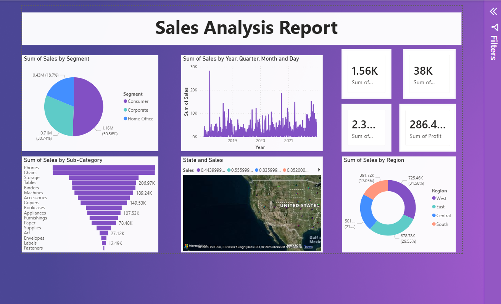
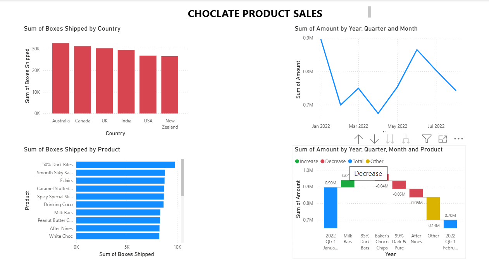
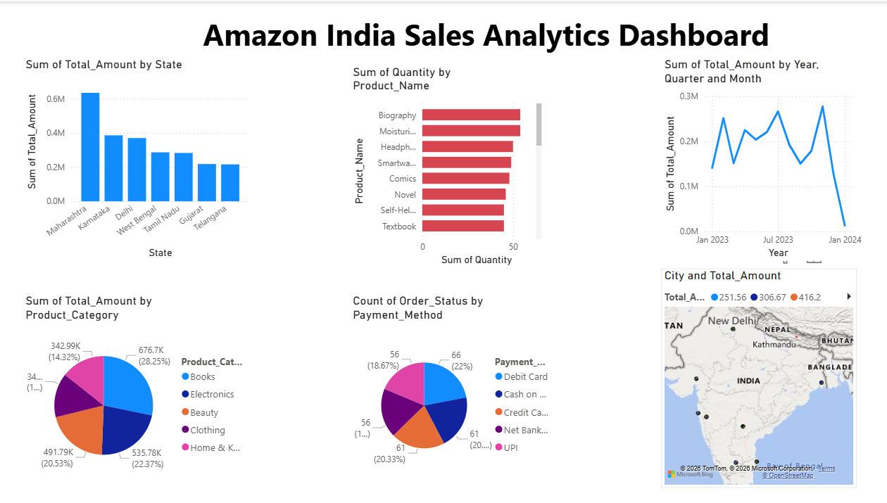

# 📊 Power BI Dashboard Projects

## 🚀 Overview

This repository contains multiple Power BI dashboards showcasing data analysis and visualization skills.

---

## 📊 Sales Dashboard

### 🔍 Key Insights

* Sales by segment and region
* Monthly trends
* Category performance

---

## 🍫 Chocolate Sales Dashboard

### 🔍 Key Insights

* Country-wise sales
* Product comparison
* Sales trends

---

## 🛒 Amazon India Dashboard

### 🔍 Key Insights

* State-wise sales
* Category insights
* Payment analysis

---

## 🛠️ Tools Used

* Power BI
* Excel
* Data Visualization

---

## 📌 How to Use

1. Download the `.pbix` file
2. Open in Power BI Desktop

---

## 👨‍💻 About Me

Aspiring Data Analyst skilled in SQL, Python, Excel, and Power BI.
